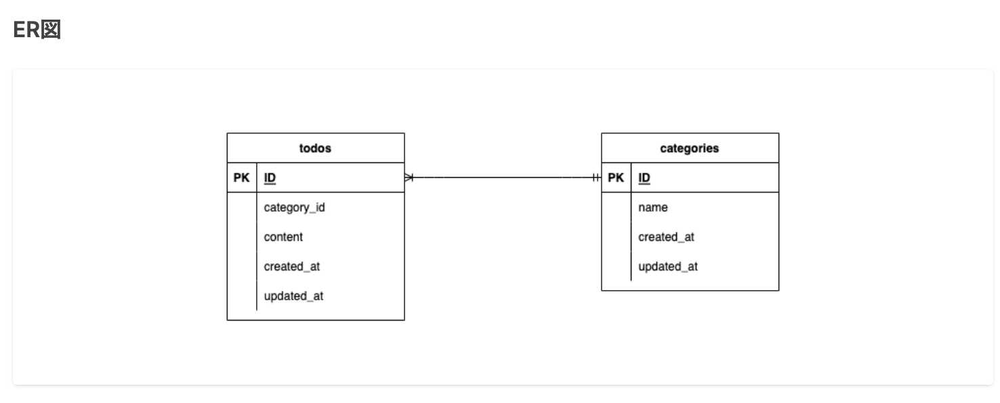

# laravel-docker-template

**### 環境構築**

1. プロジェクトをクローン

```bash

git clone git@github.com:3170sailing/TODOTEST.git

```

2. プロジェクトへ移動

```bash

cd TODOTEST

```

3. Dockerのビルド＆起動

```bash

docker compose up -d --build

```

4. PHPコンテナへログイン

```bash

docker compose exec php bash

```

5. 必要なパッケージのインストール

```bash

composer install

```

6. .env作成

```bash

cp .env.example .env

```

7. 作成された.envのDB接続を変更

```bash

DB_CONNECTION=mysql

DB_HOST=mysql

DB_PORT=3306

DB_DATABASE=laravel_db

DB_USERNAME=laravel_user

DB_PASSWORD=laravel_pass

```

8. アプリの暗号化キー（APP_KEY）を生成

```bash
php artisan key:generate

```

9. マイグレーション実行

```bash
php artisan migrate

```

10. シーディング実行

```bash
php artisan db:seed

```
## ER図


| カラム名        | 型               | Primary key | Unique key | Not null | Foreign key | 説明                  |
| ----------- | --------------- | ----------- | ---------- | -------- | ----------- | ------------------- |
| id          | unsigned bigint | ○           |            | ○        |             | 主キー                 |
| category_id | unsigned bigint |             |            | ○        | ○           | categoriesテーブルの外部キー |
| content     | varchar(20)     |             |            | ○        |             | Todoの内容（20文字以内）     |
| created_at  | timestamp       |             |            |          |             | レコード作成時刻            |
| updated_at  | timestamp       |             |            |          |             | レコード更新時刻            |


| カラム名       | 型               | Primary key | Unique key | Not null | Foreign key | 説明            |
| ---------- | --------------- | ----------- | ---------- | -------- | ----------- | ------------- |
| id         | unsigned bigint | ○           |            | ○        |             | 主キー           |
| name       | varchar(10)     |             | ○          | ○        |             | カテゴリ名（10文字以内） |
| created_at | timestamp       |             |            |          |             | レコード作成時刻      |
| updated_at | timestamp       |             |            |          |             | レコード更新時刻      |
